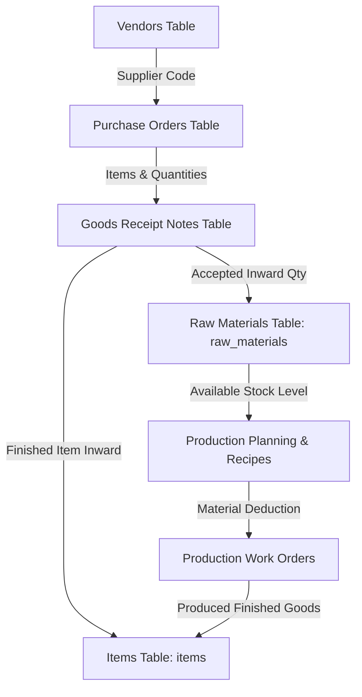
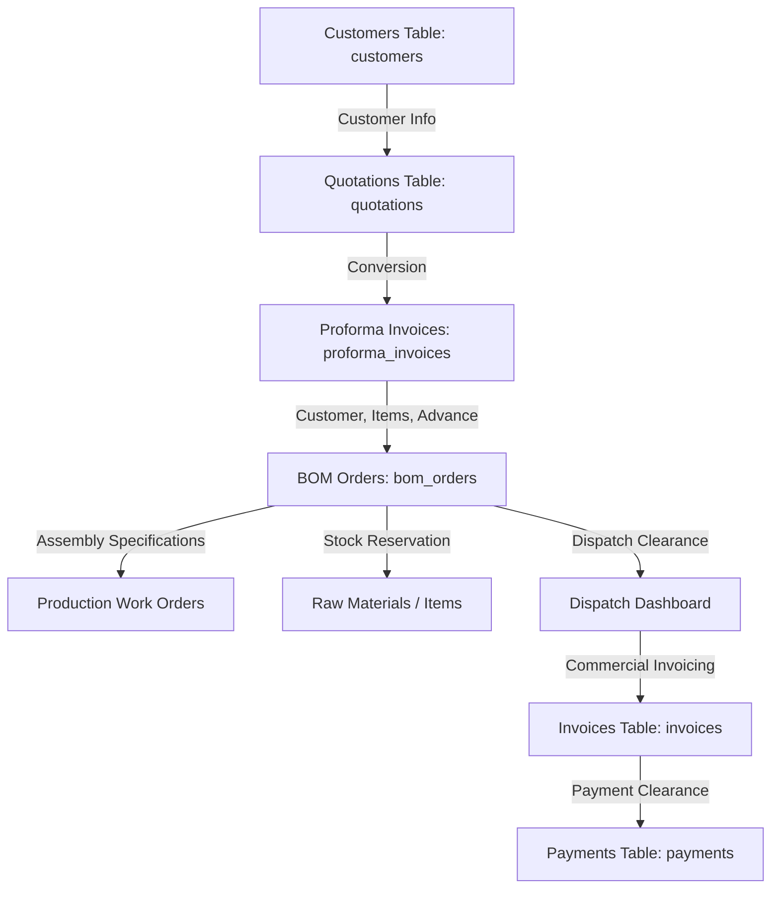
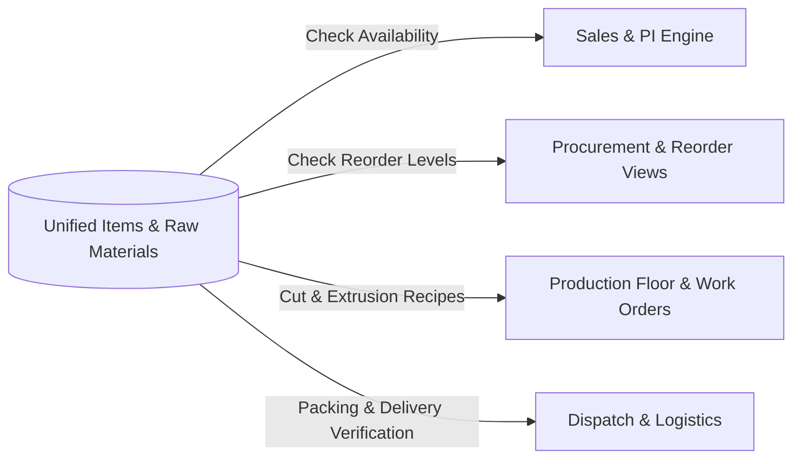

# BUSINZ CRM: Supabase Migration & Egress Stabilization Audit

**Document Version:** 1.0.0  
**Target Project:** `Businz` (Repo: `https://github.com/Annamalaiyar-creator/Businz.git`)  
**Supabase Instance:** `ognmvcpzlebrvdynunwh`  
**Execution Mode:** STRICT AUDIT ONLY (Zero source code or database modifications)

---

## 1. Executive Summary

This audit establishes the comprehensive migration and egress stabilization roadmap for **BUSINZ**. The current system relies heavily on an architectural anti-pattern where the Supabase table `public.leaves` acts as a monolithic Key-Value JSON blob store (`employee = '<STORE_NAME>'`, `reason = '<MEGA_JSON_STRING>'`).

The goal of this initiative is to **safely strangle** the legacy JSON blob storage and transition every business module to dedicated, relational PostgreSQL tables in Supabase—**without breaking cross-module visibility, without disrupting existing business flows, and without causing data loss.**

---

## 2. Phase 1: Module-by-Module Code Audit (All 23 Modules)

| # | Module Name | Current Data Source | Target Supabase Table | Legacy `leaves` Key | Read Files | Write Files | Polling / Realtime | API Endpoints | Egress Risk / Notes |
|:---|:---|:---|:---|:---|:---|:---|:---|:---|:---|
| **1** | **Inventory (Items)** | `item_store.json` + `leaves` blob | `public.items` | `ITEM_STORE` | `StockStatusView.jsx`<br>`ItemsDirectoryView.jsx`<br>`centralInventoryStore.js`<br>`server/index.js` | `ItemsDirectoryView.jsx`<br>`centralInventoryStore.js`<br>`server/index.js` | Polled in views (15s); SSE `item_store_updated` | `GET /api/store/item_store`<br>`POST /api/store/item_store`<br>`GET /api/zoho/items` | Medium; serialized item catalog sent on single item change. |
| **2** | **Raw Materials** | `raw_materials_store.json` + `leaves` blob | `public.raw_materials` | `RAW_MATERIALS_STORE` | `RawMaterialInventoryView.jsx`<br>`centralInventoryStore.js`<br>`GoodsReceiptNoteView.jsx`<br>`ProductionViewsEngine.jsx`<br>`server/index.js` | `RawMaterialInventoryView.jsx`<br>`centralInventoryStore.js`<br>`server/index.js` | Interval (pollDb 5s in RawMaterialInventory); SSE `inventory_updated` | `GET /api/raw-materials`<br>`POST /api/raw-materials`<br>`POST /api/store/raw_materials_store` | Medium-High; polled every 5s; entire material inventory serialized into single string. |
| **3** | **Sales** | `sales_pi_store.json` + `crm_quotations.json` + `leaves` | `public.proforma_invoices`, `public.quotations` | `SALES_PI_STORE`<br>`CRM_QUOTATIONS` | `SalesProformaInvoicesView.jsx`<br>`SalesCrmEngine.jsx`<br>`QuotationsView.jsx`<br>`PerformaInvoiceView.jsx` | `SalesProformaInvoicesView.jsx`<br>`SalesCrmEngine.jsx`<br>`PerformaInvoiceView.jsx` | Window broadcast `controlroom_pi_updated`, SSE `pi_updated` | `GET /api/store/sales_pi_store`<br>`POST /api/store/sales_pi_store` | High; multiple views dispatch updates on mount. |
| **4** | **Customers** | `customer_store.json` + `crm_customers.json` + `leaves` | `public.customers` | `CUSTOMER_STORE`<br>`CRM_CUSTOMERS` | 15+ Views (Dispatch, GRN, Spend, BOM, PI, CRM, etc.) | `SalesCrmEngine.jsx`<br>`CrmCustomersView.jsx`<br>`zohoSafeSync.js`<br>15 views via `saveCloudStore` | Realtime `postgres_changes` on `leaves`; SSE `crm_updated` | `GET /api/zoho/customers`<br>`GET /api/store/customer_store`<br>`POST /api/store/customer_store` | **CRITICAL**; self-triggering feedback loop between `SalesCrmEngine` and SSE causing repeated `GET` and `PATCH` on `CUSTOMER_STORE`. |
| **5** | **Procurement** | `po_store.json` + `vendor_store.json` + `leaves` | `public.purchase_orders`, `public.vendors` | `PO_STORE`<br>`VENDOR_STORE` | `PurchaseOrdersView.jsx`<br>`ProcurementReportsView.jsx`<br>`PriceComparisonView.jsx`<br>`MaterialReorderView.jsx`<br>`SpendAnalyticsView.jsx` | `PurchaseOrdersView.jsx`<br>`CreatePurchaseOrderModal.jsx`<br>`VendorManagementView.jsx` | Polled every 30s in `PurchaseOrdersView`; SSE `store_updated` | `GET /api/zoho/purchaseorders`<br>`POST /api/zoho/purchaseorders`<br>`GET /api/store/po_store` | High; 98 POs + Zoho calls executed concurrently every 30s. |
| **6** | **Purchase Orders (PO)** | `po_store.json` + `public.purchase_orders` (98 rows) + `leaves` | `public.purchase_orders` | `PO_STORE` | `PurchaseOrdersView.jsx`<br>`CreatePurchaseOrderModal.jsx`<br>`GoodsReceiptNoteView.jsx`<br>`AccountsFinanceDashboard.jsx`<br>`server/index.js` | `PurchaseOrdersView.jsx`<br>`CreatePurchaseOrderModal.jsx`<br>`server/index.js` | Polled every 30s via `getSafeZohoPOs()`; SSE `po_updated` | `GET /api/zoho/purchaseorders`<br>`POST /api/zoho/purchaseorders`<br>`GET /api/zoho/next-po-number` | High; dual existence in `leaves` blob and `purchase_orders` SQL table; disk fallback writes on every update. |
| **7** | **GRN (Goods Receipt)** | `grn_store.json` + `leaves` blob | `public.goods_receipt_notes` | `GRN_STORE` | `GoodsReceiptNoteView.jsx`<br>`PurchaseOrdersView.jsx`<br>`centralInventoryStore.js`<br>`server/index.js` | `GoodsReceiptNoteView.jsx`<br>`server/index.js` | Window event `controlroom_grn_completed`; SSE `store_updated` | `GET /api/store/grn_store`<br>`POST /api/store/grn_store` | Medium; triggers inventory stock adjustments and PO stage updates. |
| **8** | **BOM (Bill of Materials)** | `bom_store.json` + `leaves` blob | `public.bom_orders` | `BOM_STORE`<br>`BOM_SEQUENCE` | `BomOrdersView.jsx`<br>`CreateBomFormPage.jsx`<br>`DispatchDashboardView.jsx`<br>`ProductionAdminView.jsx`<br>`ProductionViewsEngine.jsx`<br>`AccountsFinanceDashboard.jsx` | `BomOrdersView.jsx`<br>`CreateBomFormPage.jsx`<br>`supabaseDataSync.js` | Polled every 12s in `BomOrdersView`, every 5s in `DispatchDashboardView`, every 5s in `ProductionAdminView`; SSE `bom_updated` | `GET /api/store/bom_store`<br>`POST /api/store/bom_store` | **CRITICAL**; 2.2 MB payload with base64 PDF and document proofs fetched every 5–12 seconds across 3 views! |
| **9** | **Production (Work Orders)** | `workorder_store.json` + `vrm_prod_workorders.json` + `leaves` | `public.production_work_orders` | `WORKORDER_STORE`<br>`VRM_PROD_WORKORDERS` | `ProductionViewsEngine.jsx`<br>`ProductionAdminView.jsx`<br>`server/index.js` | `ProductionViewsEngine.jsx`<br>`server/index.js` | Polled every 4s in `ProductionViewsEngine`; SSE `store_updated` | `GET /api/store/workorder_store`<br>`POST /api/store/workorder_store` | High; polling every 4 seconds transmits entire work order array. |
| **10** | **Production Inventory** | `vrm_prod_inventory.json` + `leaves` blob | `public.production_inventory` | `VRM_PROD_INVENTORY` | `ProductionViewsEngine.jsx`<br>`server/index.js` | `ProductionViewsEngine.jsx`<br>`server/index.js` | Polled every 4s in `ProductionViewsEngine`; SSE `item_store_updated` | `GET /api/store/vrm_prod_inventory`<br>`POST /api/store/vrm_prod_inventory` | Medium-High; mirrors raw materials and item stock for floor consumption. |
| **11** | **Production Recipes** | `vrm_prod_recipes.json` + `leaves` blob | `public.production_recipes` | `VRM_PROD_RECIPES` | `ProductionViewsEngine.jsx`<br>`server/index.js` | `ProductionViewsEngine.jsx`<br>`server/index.js` | Polled every 4s in `ProductionViewsEngine` | `GET /api/store/vrm_prod_recipes`<br>`POST /api/store/vrm_prod_recipes` | Low-Medium; static conversion recipes (e.g. 2414mm aluminium extrusion cuts). |
| **12** | **Proforma Invoice (PI)** | `proforma_invoice_store.json` + `sales_pi_store.json` + `leaves` | `public.proforma_invoices` | `PROFORMA_INVOICE_STORE`<br>`SALES_PI_STORE` | `PerformaInvoiceView.jsx`<br>`SalesProformaInvoicesView.jsx`<br>`DispatchDashboardView.jsx`<br>`AccountsFinanceDashboard.jsx` | `PerformaInvoiceView.jsx`<br>`SalesProformaInvoicesView.jsx`<br>`server/index.js` | Window event `controlroom_pi_updated`; SSE `pi_updated` | `GET /api/store/proforma_invoice_store`<br>`POST /api/store/proforma_invoice_store`<br>`GET /api/zoho/estimates` | Medium-High; shared between Sales, Accounts, Dispatch, and BOM creation. |
| **13** | **Invoices (Sales/Bills)** | `invoice_store.json` + `leaves` blob | `public.invoices` | `INVOICE_STORE` | `InvoiceUploadView.jsx`<br>`AccountsFinanceDashboard.jsx`<br>`server/index.js` | `InvoiceUploadView.jsx`<br>`server/index.js` | Polled every 15s when `activeTab === 'bills'`; SSE `invoice_updated` | `GET /api/store/invoice_store`<br>`POST /api/store/invoice_store`<br>`GET /api/zoho/invoices` | Medium; contains vendor and customer bill records. |
| **14** | **Payments** | `payment_store.json` + `leaves` blob | `public.payments` | `PAYMENT_STORE` | `PaymentsView.jsx`<br>`AccountsFinanceDashboard.jsx`<br>`server/index.js` | `PaymentsView.jsx`<br>`server/index.js` | Window event `controlroom_storage_update`; SSE `store_updated` | `GET /api/store/payment_store`<br>`POST /api/store/payment_store` | Medium; tracks vendor and customer transaction ledgers. |
| **15** | **Accounts / Finance** | Aggregation of `po_store`, `sales_pi_store`, `invoice_store`, `payment_store`, `bom_store` | Relational JOIN across target tables | N/A (Derived) | `AccountsFinanceDashboard.jsx`<br>`PaymentsView.jsx` | Dispatches verification to respective underlying stores | Polled every 15s in Accounts Dashboard | Aggregates all `/api/store/*` endpoints | High aggregate egress due to multi-store polling. |
| **16** | **CRM Leads** | `crm_leads.json` + `leaves` blob | `public.leads` | `CRM_LEADS` | `SalesCrmEngine.jsx`<br>`CrmLeadsView.jsx`<br>`server/index.js` | `SalesCrmEngine.jsx`<br>`CrmLeadsView.jsx`<br>`server/index.js` | SSE `crm_updated` | `GET /api/store/crm_leads`<br>`POST /api/store/crm_leads` | Medium; fetched on CRM engine load and leads tab switch. |
| **17** | **CRM Opportunities** | `crm_opportunities.json` + `leaves` blob | `public.opportunities` | `CRM_OPPORTUNITIES` | `SalesCrmEngine.jsx`<br>`CrmOpportunitiesView.jsx`<br>`server/index.js` | `SalesCrmEngine.jsx`<br>`CrmOpportunitiesView.jsx`<br>`server/index.js` | SSE `crm_updated` | `GET /api/store/crm_opportunities`<br>`POST /api/store/crm_opportunities` | Medium; pipeline stage changes trigger full array store rewrite. |
| **18** | **CRM Quotations** | `crm_quotations.json` + `quotations_store.json` + `leaves` | `public.quotations` | `CRM_QUOTATIONS`<br>`QUOTATIONS_STORE` | `SalesCrmEngine.jsx`<br>`CrmQuotationsView.jsx`<br>`QuotationsView.jsx`<br>`server/index.js` | `SalesCrmEngine.jsx`<br>`CrmQuotationsView.jsx`<br>`QuotationsView.jsx`<br>`server/index.js` | SSE `crm_updated` | `GET /api/store/crm_quotations`<br>`POST /api/store/crm_quotations` | Medium-High; duplicate stores (`crm_quotations` vs `quotations_store`) exist simultaneously. |
| **19** | **WhatsApp Conversations** | `crm_whatsapp_conversations.json` + `leaves` blob | `public.whatsapp_conversations` | `CRM_WHATSAPP_CONVERSATIONS` | `SalesCrmEngine.jsx`<br>`CrmWhatsAppView.jsx`<br>`realtimeSyncService.js`<br>`server/index.js` | `SalesCrmEngine.jsx`<br>`server/index.js` | SSE `whatsapp_message`; window event `controlroom_whatsapp_message` | `POST /api/whatsapp/send`<br>`GET /api/store/crm_whatsapp_conversations` | Medium; incoming webhook appends message and triggers full conversation array cloud save. |
| **20** | **Notifications** | `notifications_store.json` + `leaves` blob | `public.notifications` | `NOTIFICATIONS_STORE` | `NotificationToast.jsx`<br>`WorkflowNotificationBanner.jsx`<br>`App.jsx`<br>`server/index.js` | `NotificationToast.jsx`<br>`server/index.js` | Timer intervals in toast (every 3s progress banner); SSE `store_updated` | `GET /api/store/notifications_store`<br>`POST /api/store/notifications_store` | Low-Medium; in-memory alerts and department notifications. |
| **21** | **Users & Active Sessions** | `public.users` (30 rows) + `leaves` (`SESSION_REGISTRY` 251 rows) | `public.users` (for credentials), active session table/indexed query | `SESSION_REGISTRY`<br>`EMPLOYEES_STORE` | `sessionService.js`<br>`DeveloperPortalView.jsx`<br>`App.jsx`<br>`supabaseDataSync.js` | `sessionService.js`<br>`DeveloperPortalView.jsx`<br>`App.jsx` | Polled every 25s (`heartbeatActiveSession`); polled every 15s in Developer Portal | None (direct Supabase Client calls) | **CRITICAL**; heartbeat runs every 25s per tab; 251 records scanned and returned without limits. |
| **22** | **Company Branding** | `company_branding_store.json` + `public.company_branding` (id=1) + `leaves` | `public.company_branding` | `COMPANY_BRANDING_STORE` | `CompanyBrandingModal.jsx`<br>`App.jsx`<br>`zohoSafeSync.js`<br>`server/index.js` | `CompanyBrandingModal.jsx`<br>`server/index.js` | On-mount fetch; SSE `store_updated` | `GET /api/branding`<br>`POST /api/branding` | Low; static company headers, GSTIN, CIN, and digital signature stamps. |
| **23** | **Media Assets** | Disk filesystem `server/uploads/` + base64 data URLs in JSON stores | `public.media_assets` (with Supabase Storage bucket) | Inlined in `BOM_STORE` and `PO_STORE` | `BomOrdersView.jsx`<br>`PurchaseOrdersView.jsx`<br>`server/backupEngine.js` | `CreateBomFormPage.jsx`<br>`CreatePurchaseOrderModal.jsx`<br>`server/index.js` | None | `POST /api/upload`<br>`GET /uploads/*` | **CRITICAL**; raw base64 data URLs inlined in JSON strings are the #1 cause of megabyte-sized database rows. |

---

## 3. Phase 2: Cross-Module Data Dependency Map

The CRM, Procurement, Inventory, Production, and Sales chains are deeply interdependent. A unified source of truth is essential so that a stock change in GRN immediately reflects in Sales and Production.

### Chain A: Procurement → GRN → Inventory → Production


### Chain B: Sales → Quotation → Proforma Invoice → BOM → Production / Dispatch


### Chain C: Shared Inventory Single Source of Truth

> **Single Source of Truth Rule:** `items` and `raw_materials` MUST remain the authoritative stock records. Production, Sales, and Procurement must query and update the same underlying rows, rather than maintaining independent stock tallies.

---

## 4. Phase 3: Target Source of Truth & Consolidation

| Source Legacy Stores | Canonical Supabase Table | Primary Key | Key Matching & Normalization Strategy |
|:---|:---|:---|:---|
| `customer_store.json` + `crm_customers.json` | `public.customers` | `customer_code` (TEXT) | Merge by normalized `customer_code` or `zoho_contact_id`. Retain all contact persons, GSTIN, and billing/shipping addresses. |
| `vendor_store.json` | `public.vendors` | `code` (TEXT) | Match on vendor code (e.g. `VND-001`) or normalized vendor company name. |
| `item_store.json` | `public.items` | `code` (TEXT) | Unique item code / SKU (e.g. `ALU-LEN-2414MM`). |
| `raw_materials_store.json` | `public.raw_materials` | `code` (TEXT) | Unique raw material code / SKU (e.g. `RM-ALU-2414`). |
| `po_store.json` + existing 98 SQL rows | `public.purchase_orders` | `po_no` (TEXT) | **PRESERVE EXISTING 98 SQL ROWS.** Upsert new fields without deleting or resetting sequence numbers (`PO-000XX`). |
| `grn_store.json` | `public.goods_receipt_notes` | `grn_no` (TEXT) | Match on GRN number (e.g. `GRN-2026-001`). Foreign reference to `po_no`. |
| `bom_store.json` | `public.bom_orders` | `bom_code` (TEXT) | Unique BOM code (`BOM-XXX`). Externalize heavy base64 proof documents to `media_assets` or Supabase Storage. |
| `workorder_store.json` + `vrm_prod_workorders.json` | `public.production_work_orders` | `work_order_no` (TEXT) | Match on `work_order_no` (e.g. `WO-2026-001`). |
| `vrm_prod_inventory.json` | `public.production_inventory` | `code` (TEXT) | Item code. Sync bidirectionally with `raw_materials`. |
| `vrm_prod_recipes.json` | `public.production_recipes` | `id` (TEXT) | Unique recipe identifier. |
| `vrm_prod_ledger.json` | `public.production_ledger` | `id` (BIGSERIAL) | Sequential transaction ledger. |
| `proforma_invoice_store.json` + `sales_pi_store.json` | `public.proforma_invoices` | `pi_no` (TEXT) | Unique PI number (e.g. `PI-2026-001`). |
| `invoice_store.json` | `public.invoices` | `inv_no` (TEXT) | Commercial invoice number. |
| `payment_store.json` | `public.payments` | `id` (TEXT) | Payment reference number. |
| `crm_leads.json` | `public.leads` | `id` (TEXT) | Lead identifier. |
| `crm_opportunities.json` | `public.opportunities` | `id` (TEXT) | Opportunity deal identifier. |
| `crm_quotations.json` + `quotations_store.json` | `public.quotations` | `quote_number` (TEXT) | Standardized quote code (`QT-2026-XXX`). |
| `crm_whatsapp_conversations.json` | `public.whatsapp_conversations` | `id` (TEXT) | Unique conversation key (indexed by phone number). |
| `presets_store.json` | `public.bom_presets` | `id` (TEXT) | Preset configuration key. |
| `notifications_store.json` | `public.notifications` | `id` (TEXT) | Notification identifier. |
| `company_branding_store.json` | `public.company_branding` | `id` (INTEGER = 1) | Single singleton row (`id = 1`). |
| Inlined base64 data URLs | `public.media_assets` | `file_name` (TEXT) | Move base64 blobs to indexed files with lightweight metadata URLs. |

---

## 5. Phase 4: Migration Strategy (Strangler Pattern)

To ensure zero downtime and zero business disruption, the migration follows a **6-stage Strangler Fig approach** per module:

```
Step 1: Audit & Schema Verification
  ↓
Step 2: Dual-Write (Writes persist to both the new Supabase table AND legacy fallback store)
  ↓
Step 3: Verification (Cross-check record counts, IDs, and fields)
  ↓
Step 4: Switch Reads (Read primarily from the new Supabase table; fall back to legacy if empty)
  ↓
Step 5: Business Flow Verification (Validate cross-module updates, e.g. PO -> GRN -> Stock)
  ↓
Step 6: Decommission Legacy Key (Remove legacy blob read/write for that specific module only)
```

### Recommended Migration Sequence:

1. **Module 1: `company_branding`**  
   *Rationale:* Lowest risk, singleton row, immediate test of Supabase client integration without affecting transactions.
2. **Module 2: `customers`**  
   *Rationale:* High impact on egress (stops the `CUSTOMER_STORE` ping-pong loop), cleanly separated schema, shared across Sales, CRM, PI, and BOM.
3. **Module 3: `vendors`**  
   *Rationale:* Independent master entity required for Procurement and POs.
4. **Module 4: `items` & `raw_materials`**  
   *Rationale:* Establishes the single source of truth for stock before transaction tables (GRN, BOM, Production) are switched.
5. **Module 5: `purchase_orders`**  
   *Rationale:* Merges existing 98 SQL rows with cloud sync, establishes PO number stability.
6. **Module 6: `goods_receipt_notes` (GRN)**  
   *Rationale:* Directly bridges POs to Raw Material stock updates.
7. **Module 7: `proforma_invoices` (PI)**  
   *Rationale:* Connects Sales to BOM orders.
8. **Module 8: `bom_orders`**  
   *Rationale:* Highest egress saver (removes 2.2 MB blob), relies on Customers, Items, and PI.
9. **Module 9: `production_work_orders`, `production_inventory`, `production_recipes`**  
   *Rationale:* Connects BOM orders to factory floor operations.
10. **Module 10: `invoices` & `payments`**  
    *Rationale:* Connects BOM and PI to Accounts and financial ledgers.
11. **Module 11: `leads`, `opportunities`, `quotations`, `whatsapp_conversations` (CRM Suite)**  
    *Rationale:* Upstream pipeline feeding into Customers and Quotations.
12. **Module 12: `session_registry` & `notifications`**  
    *Rationale:* Egress cleanup for polling sessions and system alerts.

---

## 6. Phase 5: First Implementation Candidate Analysis

### Selected First Module: `company_branding` followed by `customers`

#### Option A: `company_branding` (Safest Smoke Test)
- **Why First:** Only 1 record (`id = 1`). No dependencies on other tables. Allows end-to-end verification of Supabase client reading and writing without touching transactional data.
- **Affected Files:**
  - `src/components/CompanyBrandingModal.jsx`
  - `src/App.jsx`
  - `server/index.js`
- **Rollback:** Instantaneous. In-memory and disk fallback (`company_branding_store.json`) remain intact.

#### Option B: `customers` (Maximum Immediate Egress Reduction)
- **Why First Among Business Entities:**
  1. Stops the prominent `GET /rest/v1/leaves?select=id&employee=eq.CUSTOMER_STORE&order=id.desc` loop observed in the Supabase logs.
  2. Table `public.customers` already exists in Supabase (created in Phase 2).
  3. Replaces the full array serialization in `leaves` with clean relational queries (`select('*')` or paginated `select('id, customer_code, company_name, email, phone')`).
- **Files That Will Change (When Approved):**
  - `src/services/zohoSafeSync.js`
  - `src/components/crm/SalesCrmEngine.jsx`
  - `src/components/crm/CrmCustomersView.jsx`
  - `server/index.js`
- **Database Tables Used:**
  - `public.customers`
- **Old Functions Maintained Temporarily:**
  - `fetchCloudStore('customer_store')` will be redirected internally to query `public.customers`, maintaining 100% backward compatibility with all 15 views without having to rewrite 15 views simultaneously.
- **Rollback Mechanism:**
  - `customer_store.json` on disk and the dual-write to `leaves` can be preserved during the first 48-hour testing window.

---

## 7. Specific Root Cause Solutions (Egress & Stability)

### 1. Eliminating the `CUSTOMER_STORE` Ping-Pong Loop
- **Problem:** `SalesCrmEngine.jsx` updates state on mount -> saves to cloud -> server sends SSE `store_updated` -> browser event listener catches SSE -> re-runs `syncCloudCrm()` -> saves to cloud again.
- **Solution:** 
  1. Add a source origin flag to save calls (`isRemoteSync = true`).
  2. Only dispatch broadcast events if data has genuinely changed (deep comparison or hash check).
  3. Query `public.customers` directly via Supabase client rather than round-tripping through `server/index.js` and `leaves`.

### 2. Eliminating the 25-Second `SESSION_REGISTRY` Storm
- **Problem:** Unconditional 25s interval in `App.jsx` issues `GET` + `PATCH` on `leaves`, and Developer Portal pulls all 251 rows without limits.
- **Solution:**
  1. Increase heartbeat interval from 25s to 60s.
  2. Query `leaves` with `.eq('duration', sessionId).limit(1)` selecting ONLY `id, dates, status` (not the serialized `reason` string).
  3. In `fetchLiveActiveSessions()`, add SQL filters: `.eq('status', 'active').gte('dates', <1_hour_ago>).limit(20)`.

### 3. Eliminating the 2.2 MB `BOM_STORE` Polling Spike
- **Problem:** `BomOrdersView.jsx` (12s), `DispatchDashboardView.jsx` (5s), and `ProductionAdminView.jsx` (5s) poll `bom_store` repeatedly, transferring the entire BOM array with inlined base64 documents.
- **Solution:**
  1. Replace aggressive polling with Supabase Realtime event listeners on `public.bom_orders`.
  2. Separate document proofs (`payment_proof_doc`, `delivery_address_proof_doc`) into `public.media_assets`, storing only lightweight URL references in `public.bom_orders`.
  3. Standardize fallback polling to 60s only when the tab is actively visible (`document.visibilityState === 'visible'`).

---

## 8. Rollback Strategy & Data Protection Guarantees

1. **Zero Data Deletion Guarantee:**
   - Existing rows in `public.users` (30 rows), `public.purchase_orders` (98 rows), and `public.leaves` (273 rows) will NEVER be dropped or truncated.
2. **Dual-Read Fallback Architecture:**
   ```javascript
   // Pattern for safe transition
   const { data, error } = await supabase.from('customers').select('*');
   if (!error && Array.isArray(data) && data.length > 0) {
     return data; // New relational table
   }
   // Transparent fallback to legacy store if empty
   return await fetchLegacyStoreFallback('customer_store');
   ```
3. **Automated Checkpoints:**
   - Git commits tagged per module (`migration-step-customers`, `migration-step-vendors`, etc.).
   - Local JSON store files preserved in `server/` as emergency offline archives.

---

## 9. Cross-Module Verification Checklist

Before and after each module is migrated, the following test matrix must pass:

- [ ] **App Launch & Auth:** App loads, login succeeds, user roles are verified.
- [ ] **Inventory Cross-Visibility:**
  - Inward a GRN -> Verify stock increases in `RawMaterialInventoryView`.
  - Verify `ProductionViewsEngine` sees updated material availability.
  - Verify `ItemsDirectoryView` shows identical physical stock.
- [ ] **Purchase Order Flow:**
  - Create PO -> Appears in `PurchaseOrdersView` with sequential Zoho number (`PO-000XX`).
  - Appears in `AccountsFinanceDashboard` for approval.
  - Accessible in `GoodsReceiptNoteView` for inwarding.
- [ ] **BOM to Production & Dispatch:**
  - Create BOM -> Generates unique `BOM-XXX` code.
  - Appears in `ProductionViewsEngine` and `ProductionAdminView`.
  - Appears in `DispatchDashboardView` for dispatch packing and verification.
- [ ] **Customer Consistency:**
  - Edit customer in `CrmCustomersView` -> Updated details appear in `CreateBomFormPage` and `PerformaInvoiceView`.
  - No recursive save loops in network tab.
- [ ] **Supabase Egress Monitoring:**
  - Inspect browser Network tab: Zero calls to `leaves?employee=eq.<STORE_KEY>`.
  - Inspect payload size: Responses under 10 KB per request (down from 2.2 MB).

---

*(Audit completed. No application code, database schema, or stored data has been modified.)*
